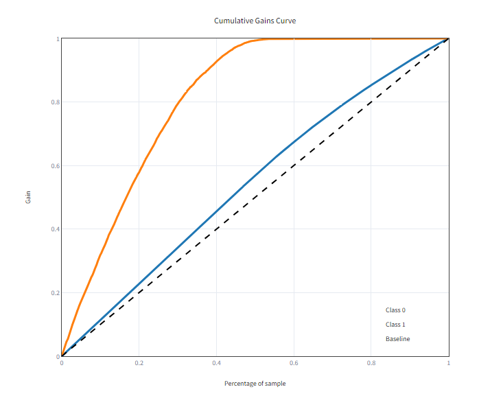

# Health Insurance Cross-Sell Project
##  Propensão de Compra com Classificação

## Estrutura de Arquivos e Diretórios do Projeto
 **/api/** : contém a classe que realiza a limpeza, transformação, preparação, e por fim, retorna as probabilidades de um cliente comprar ou não o seguro de automóveis.

**/data/** : contém os conjuntos de dados de treino(train.csv) e teste(test.csv)

**/img/** : contém as imagens utilizadas no projeto

**/models/** : contém os arquivos dos modelos de machine learning, responsáveis pelas predições que visam solucionar o problema de negócio.

**/notebooks/** : contém os arquivos *.ipynb, que mostra o codigo python que foi desenvolvido em cada uma das etapas do projeto. Desde a coleta dos dados, passando pelas análises dos dados até o deploy do modelo em produção.

**/parameters/** : contém os arquivos que realizam as transformações de features necessárias para maior performance dos modelos de machine learning.

**handler.py** : este arquivo é responsável por receber a requisição http (url + porta + endpoint), chamar a classe HICS.py que está no diretório (/api/), e responder a requisição com os valores da predição. Para executá-lo, acesse o Terminal do seu Sistema Operacional, e no diretório raiz deste projeto digite "python handler.py". Este comando habilitará o handler.py a receber requisições http.

**monitor.py** : este arquivo é uma aplicação escrita em python que permite visualizar os resultados da aplicação do modelo utilizando os dados de teste como parâmetro de entrada. Esta aplicação monta vários dashboards onde é possível visualizar as métricas de performance do modelo. Para executá-la, acesse o Terminal do seu Sistema Operacional, e no diretório raiz deste projeto digite "streamlit run monitor.py". O seu navegador de internet será aberto com a aplicação web "H.I.C.S Monitor".

**requirements.txt** : contém as bibliotecas do python necessárias para a execuçao do projeto. Essas bibliotecas precisam ser instaladas no seu ambiente. Para isso, acesse o terminal do seu Sistema Operacional, entre no diretório raiz deste projeto e digite: "pip install -r requirements.txt". .

## 1. Questão de Negócio

O cliente deste projeto é uma seguradora de planos de saúde que pretende passar a oferecer aos seus segurados um novo produto: Seguro de automóveis. Para tal, contratou uma pesquisa para que seus clientes respondessem a seguinte pergunta: Você contrataria um seguro de automóvel conosco ?

A pesquisa foi encomendada pela área comercial da Companhia, que solicitou ao setor de Dados um projeto que potencialize o processo de captação dos clientes do plano de saúde para o seguro de automóveis. O setor Financeiro também deseja que o produto de dados seja capaz de realizar previsões de custos operacionais e de receitas para diversos cenários de conversões de clientes. Completando os stakeholders, o setor de Atendimento ao Cliente será responsável pela operação de vendas do novo produto e para tal solicitou a relação dos possíveis interessados.

## 2. Premissas de Negócio

### 2.1 O Conjunto de Dados

Foram entrevistados cerca de 380 mil clientes da Companhia de Seguros. Além da resposta, os seguintes dados dos clientes serão disponibilizados ao time de Dados:

A base de dados utilizada na construção desse projeto pode ser encontrada dentro da plataforma [Kaggle](https://www.kaggle.com/datasets/anmolkumar/health-insurance-cross-sell-prediction).
O conjunto de dados deste projeto está no arquivo **train.csv**

As colunas da base de dados são:

| Nome da Coluna | Descrição da Coluna |
| :------------- | :----------------------------------------------------------------------------------------------------------------------------------------------------------------------------------------------------------------------------------------------------------------------------------------------------------------------------------------------------------------- |
| id | ID do cliente                            |
| gender | Gênero do cliente |
| age | Idade do cliente|
| driving_license | 0 : Cliente não tem licença para dirigir / 1 : Cliente tem licença para dirigir |
| region_code | Código da região do cliente  |
| previously_insured | 0 : Cliente não possui seguro de automóvel / 1 : Cliente já possui seguro de automóvel|
| vehicle_age | Idade do veículo |
| vehicle_damage | 0 : Veículo já envolvido em aciedente / 1 : Veículo nunca envolvido em acidente |
| annual_premium | Valor anual do seguro pago pelo cliente|
| policy_sales_channel | Código do canal de divulgação ao cliente  |
| vintage | Número de Dias que o cliente é segurado da Companhia |
| response | 0 : Cliente não interessado / 1 : Cliente interessado |

### 2.2 Ferramentas e Métodos Utilizados
- Python 3.11.5
- Jupyter Notebook e VS Code
- Metodologia CRISP-DS
- Git e GitHub
- Aprendizado Supervisionado - Classificação
- Algoritmos: KNN, Logistic Regression, Extra Trees e LGBM Classifier

### 2.3 Restrições
* Por se tratar de uma Empresa com milhões de clientes, há uma limitação operacional da equipe atendimento ao cliente. Portanto, o produto de dados deve potencializar esse recurso.
* Há limitações de natureza orçamentária, o custo operacional não pode comprometer a receita proveniente da venda do novo produto. Logo, o produto de dados precisa comprovar que é mais eficiente que um modelo aleatório.
* Os dados coletados pela pesquisa compreende um universo de aproximadamente 380 mil clientes, que conterá além da resposta de interesse ou não, dados como: gênero e idade do segurado, relacionados à veículos, valor de seguro, entre outros.

### 2.4 Perguntas de Negócio
01. Qual número e percentual de clientes interessados em adquirir o seguro automóvel foram apurados a partir da pesquisa ?
02. Qual o percentual de clientes que comprarão o seguro automóvel para cada faixa percentual de 10% do total de clientes ?
03. Em quantas vezes, o modelo do projeto é mais eficiente que um modelo aleatório de escolhas de clientes ?
04. Quais as previsões de custo operacional do modelo para cada faixa de 10% de clientes interessados em adquirir o seguro de automóveis ? Considere um custo médio de U$ 5.00 por cliente contactado. Compare com o modelo aleatório.
05. Quais as previsões de receita do modelo para cada faixa de 10% de clientes contactados ? Considere um ticket médio de U$ 120.00 por seguro vendido. Compare com o modelo aleatório.
06. Faça as mesmas previsões dos dois itens anteriores considerando um percentual específico de clientes que comprarão o seguro de automóveis. Informe o número e o percentual de clientes contactados para o atingimento desta meta. Crie uma listagem que identifique esses clientes.
07. Que insights obtidos pela análise de dados podem contribuir para o negócio da empresa ?

## 3. Planejamento da Solução
01. **Especificação da Questão de Negócio**: Delimitar o escopo do projeto, quem são os interessados, as premissas, os objetivos.
02. **Coleta e Tratamento de Dados**: Verificar se há dados faltantes, duplicados ou inconsistentes.
03. **Análise Descritiva dos Dados**: Visualizar métricas de tendência central, frequência e distribuição dos dados.
04. **Elaboração de Hipóteses de Negócio**: Criar a partir do dados originais, dados derivados ou conhecimento empírico afirmações (hipóteses) sobre o fenômeno estudado.
05. **Análise Exploratória dos Dados**: Validar ou invalidar as hipóteses levantadas no passo anterior, a partir das análises da relações e correlações das variáveis do modelo. Além disso, gerar insights que possam ser convertidos em retorno financeiro para a Empresa.
06. **Preparação e Seleção dos Atributos**: Utilizar técnicas e ferramentas que permitam que os dados representem o fenômeno estudado.
07. **Geração de Modelos de Machine Learning**: Criar, treinar e validar modelos que permitam responder às perguntas de negócios, utilizando métricas de performance para escolha do melhor modelo
08. **Aprimoramento do Modelo**: Ajustar os parâmetros do modelo selecionado para obtenção de melhor performance.
09. **Comunicação dos Resultados aos Stakeholders**: Apresentar as métricas que comprovam a eficiência da aplicação do modelo,  demonstrar as previsões do modelo e responder às perguntas de negócio. Apresentar também, as lições aprendidas e os próximos passos do projeto.
10. **Deploy do Modelo**: Colocar o modelo em ambiente de produção para que possa ser consumido e abastecido com novos dados.

## 4. Análise de Dados

A pesquisa encomendada foi realizada com **381.109** clientes dos planos de saúde da Seguradora. Destes, **46.710 (12,26%)** responderam que possuem interesse em adquirir o seguro de automóveis da Empresa. Os que não tem interesse totalizaram **334.399 (87,74%)**.

### 4.1 Distribuição dos Dados 

Para efeito da geração do modelo de Machine Learning do projeto, os dados foram distribuídos em 3 grupos: Treino (80%), Validação (10%) e Teste (10%). Os clientes foram distribuídos nos grupos de forma proporcional a sua resposta do questionário. A tabela abaixo mostra os valores absolutos e percentuais de cada grupo. Os clientes interessados no seguro automóvel estão representados nas colunas (**Rows Positive Class**), enquanto que os não interessados na (**Rows Negative Class**)

### 4.2 Hipóteses

Foram levantadas hipóteses cujo objetivo era identificar em quais **características(features)** a proporção de clientes interessados no seguro automóvel apresentava uma variação significativa em comparação ao total de clientes entrevistados.

* **Hipótese 1** : Clientes do sexo masculino possuem **MAIOR** interesse em adquirir o seguro automóvel.
    * **Conclusão** : ***HIPÓTESE VERDADEIRA***, **61%** dos clientes interessados no seguro automóvel são do sexo masculino. Enquanto que o percentual geral de clientes do sexo masculino é de **54%**

* **Hipótese 2** : Clientes mais velhos possuem **MAIOR** interesse em adquirir o seguro automóvel
    * **Conclusão** : ***HIPÓTESE VERDADEIRA***, **71%** dos clientes interessados em adquirir o seguro automóvel possuem idade superior a mediana ( 36 anos ). Obviamente, o percentual geral de clientes com idade superior a mediana é **50%**. 

* **Hipótese 3** : Clientes que possuem carros mais novos possuem **MAIOR** interesse em adquirir o seguro automóvel.

## 5. Modelos de Machine Learning

Foram treinados 4 modelos de Machine Learning, considerando as condições a seguir:

* **Learning to Rank** : As predições de cada modelo serão ordenadas do cliente com maior propensão ao cliente de menor propensão de adquirir o seguro automóvel.
* **Medição das Predições** : Calcular o percentual de clientes interessados no seguro automóvel em relação ao percentual geral de clientes. Esses percentuais serão agrupados em faixas que vão de 10% a 100%, em intervalos de 10%.
* **Métricas Utilizadas** : 
    * **Recall_at_k** : Relação entre a quantidade acumulada de clientes interessados em adquirir o seguro automóvel e a quantidade total de clientes interessados em adquirir o seguro automóvel.
    * **Curva de Ganho Acumulada** : Representação gráfica da relação entre o percentual de clientes interessados no seguro automóvel e o percentual geral de clientes.
    * **Curva Lift** : Representação gráfica que demonstra em quantas vezes o modelo de predição do projeto é mais ou menos performático em relação a um modelo de escolhas aleatórias de clientes.
* **Single Performance** : Predições realizadas sobre 20% da base de validação, escolhida de forma aleatória.
* **Cross-Validation** : Predições realizadas sobre 100% da base de validação, fracionada em 5 partes iguais. O valor final será a média de cada faixa percentual.
* **Seleção do Modelo** : Será considerado o melhor modelo aquele que conseguir identificar o maior percentual de clientes interessados no seguro automóvel com o menor percentual geral de clientes.
* **Fine Tuning** : Realizar um ajuste fino nos hiperparâmetros do modelo final, de forma a encontrar a melhor configuração possível para o modelo.
* **Apresentação dos Resultados** : A performance do modelo a partir das  métricas de negócio, projeções financeiras e insights de negócio serão apresentados aos stakeholders do projeto.

### 5.1 Modelos Utilizados
- K-Nearest Neighbors (KNN)
- Regressão Logistica (RL)
- Extra Trees (ET)
- LightGBM - LGBM Classifier (LGBM)

### 5.2 Performance dos Modelos
Todos os modelos apresentaram consistência no processo de aprendizagem e capacidade de generalizar o fenômeno estudado. A tabela a seguir, mostra a performance de cada modelo treinado.

A coluna **perc_customers** indica o percentual geral de clientes. As colunas posteriores representam o percentual que cada modelo projeta que captará de clientes interessados no seguro automóvel. Observamos que até as faixas de 50% de clientes, o **modelo LGBM** atinge os maiores percentuais.
Por exemplo: Para atingir 91% de novos clientes seria necessário contactar 40% do total de clientes que participaram da pesquisa.

A curva de ganho acumulada de cada modelo confirma os valores apresentados na tabela anterior. 

Observamos que a curva do modelo LGBM é a mais acentuada em relação aos eixos, significa que ela atinge o maior número de clientes novos (eixo y) com a menor quantidade de clientes em geral (eixo x).

### 5.3 Modelo Final - Fine Tuning

## 6. Resultados de Negócio

### 6.1 Insights 

Os insights extraídos pela análise de dados identificaram um perfil de cliente que deseja adquirir o seguro automóvel. Ele, de forma geral, é do gênero masculino, com idade superior a 36 anos e seu veículo possui entre 1 e 2 anos de uso. 

**1.** **74%** dos clientes interessados no seguro automóvel possuem veículos com idade entre 1 e 2 anos. Esse grupo representa **54%** do total de clientes

**2.** **45%** dos clientes interessados no seguro automóvel são do gênero masculino com idade acima dos 36 anos. Esse grupo representa **31%** do total de clientes

**3.** Apenas **29%** dos clientes interessados no seguro automóvel possuem idade até os 36 anos. Este grupo representa **50%** do total de clientes

### 6.2 Curva de Ganho Acumulado

A curva de ganho acumulado permite visualizar graficamente qual o percentual de clientes contactados necessário (eixo X), para conseguir captar um determinado percentual de clientes interessados no seguro automóvel (eixo Y). Observe que entrando em contato com 20% dos clientes é possível captar quase 60% dos clientes interessados. 

### 6.3 Curva Lift

O objetivo da Curva Lift é comparar a performance do modelo deste projeto com um modelo de escolhas aleatórias de clientes. O Modelo do Projeto está representado pela linha laranja, enquanto que o modelo aleatório pelo ponto tracejado. O eixo X representa o percentual total de clientes entrevistados, o eixo Y representa o número de vezes em que o modelo do projeto é mais performático que o modelo aleatório. Observe que a performance do modelo aleatório é sempre constante (igual a 1). Já o modelo do projeto é praticamente 3 vezes mais performático quando o percentual de clientes está em 20%, 2,5 vezes quando o total de clientes está em 40% e 2 vezes quando está em 50%. 

Um modelo que performa 2,5 vezes mais que outro, significa que custará 2,5 menos, que proverá 2,5 mais receitas. Os gráficos de previsão de custos e receitas mostrarão essas diferenças em valores absolutos. 

### 6.4 Previsão de Custos

### 6.5 Previsão de Receitas

## 7. Conclusões

O modelo apresentou em todas as métricas desempenho muito superior ao modelo aleatório, justificando o investimento nesse tipo de solução. 

Somente com os insights gerados a partir dos de clientes já seria possível atingir 74% de interessados entrando em contato com 54% do total de clientes.

## 8. Próximos Passos

Implementar o modelo em Cloud com MLOps e banco de dados.
